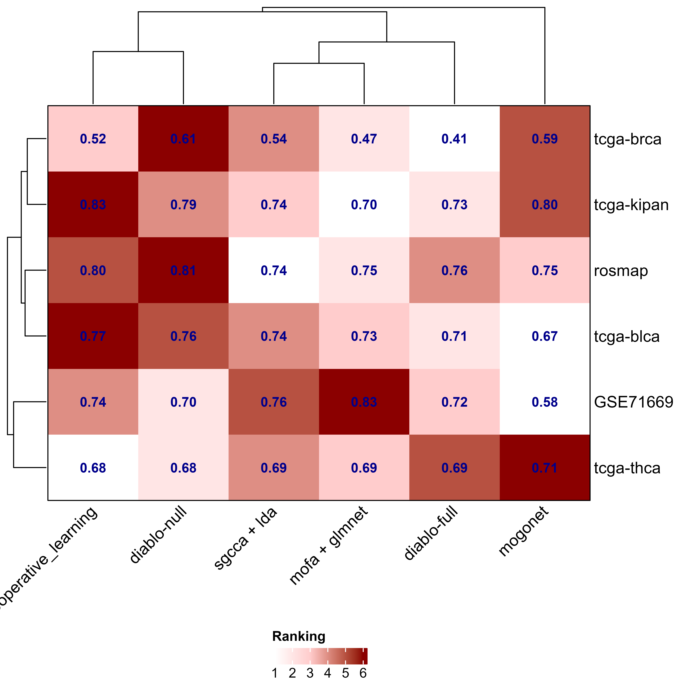
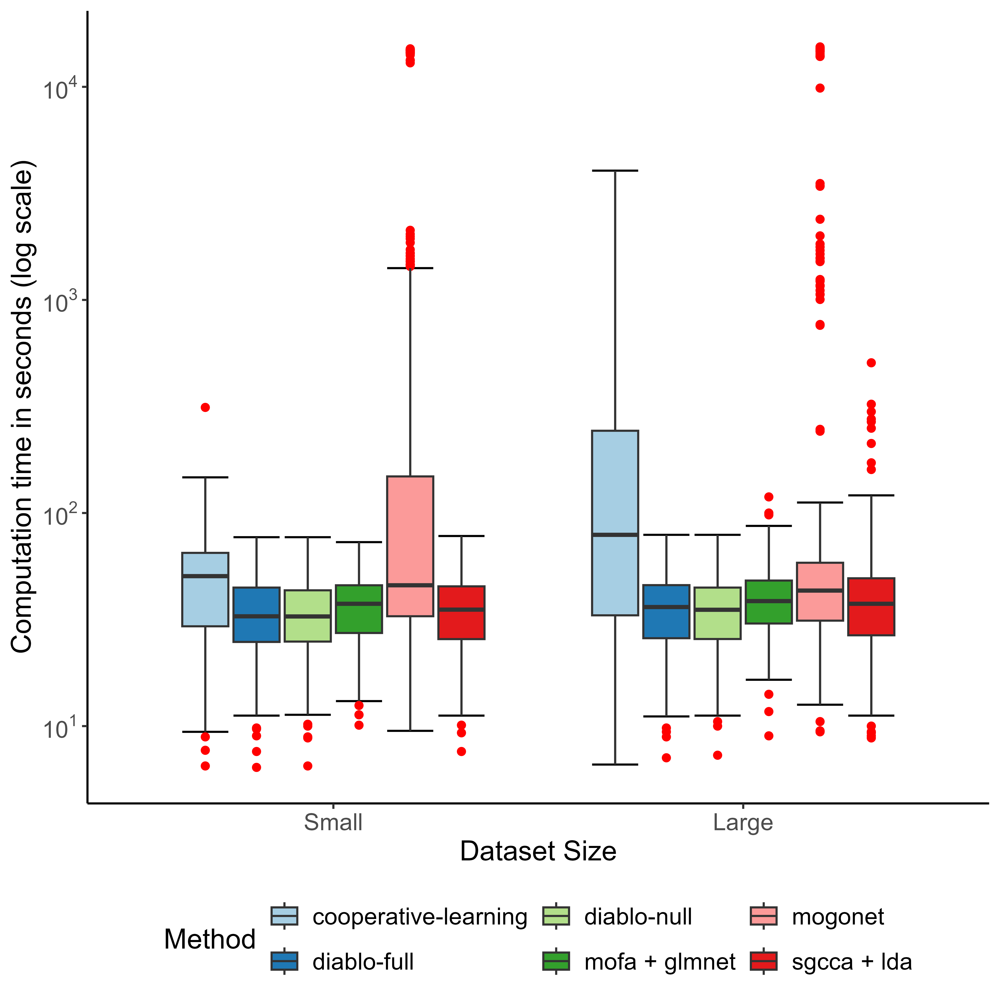
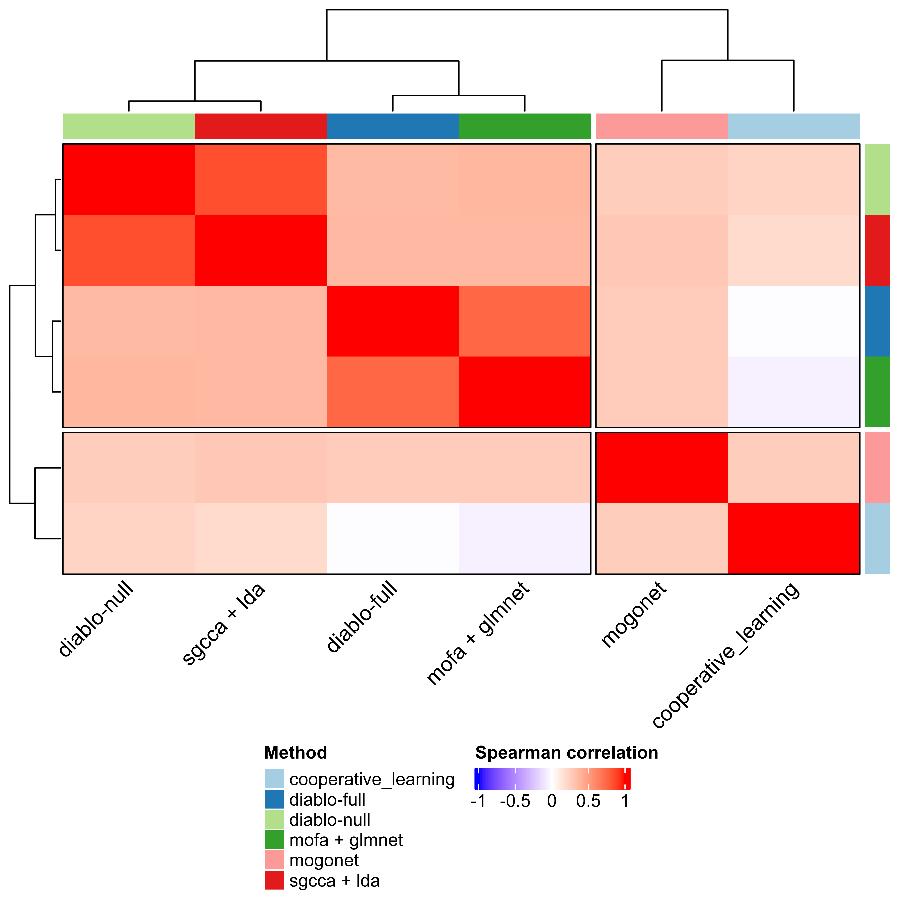
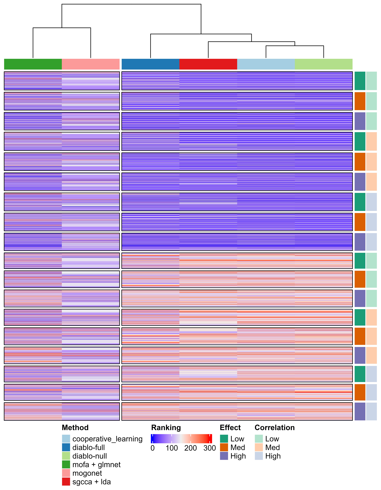

# MLCB 2024 Poster figures

Sep 5-6 @Seattle University of Washington

## Figures

**Classification performance**

**Performance on simulated data**

**Computational time of methods**

**Spearman rank correlation between feature weights in real datasets**

**Ranking feature weights on simulated datasets stratified by effect and correlation**

